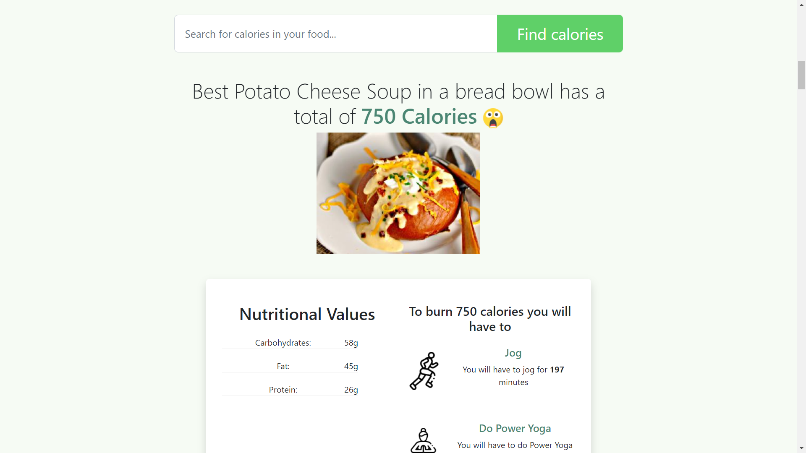
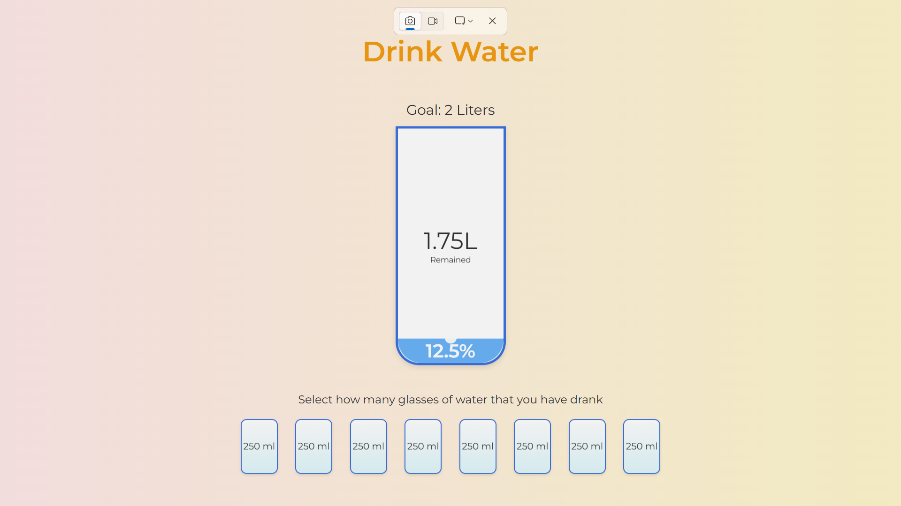
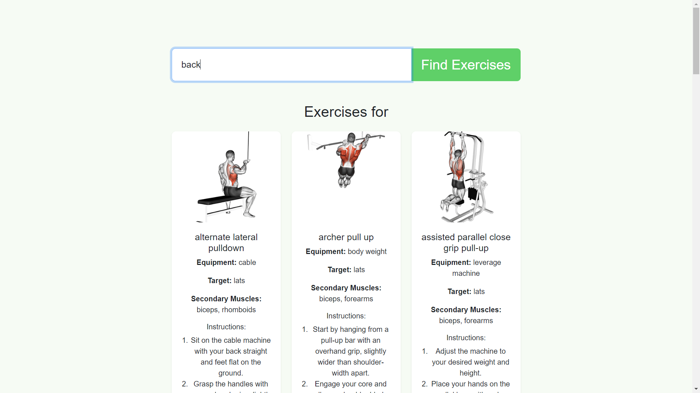
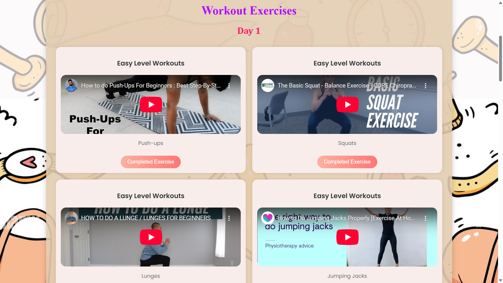
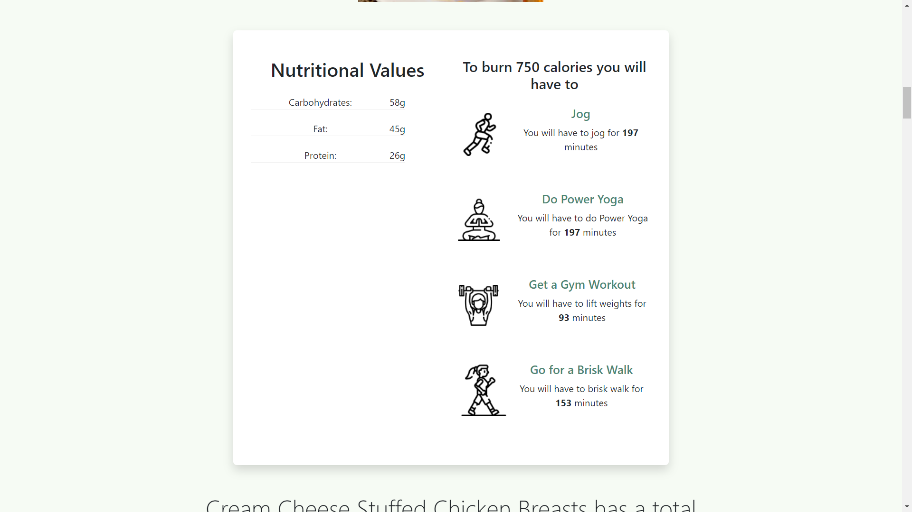

# 🩺 Health Hub
 Health_Hub is an all-in-one fitness and wellness tracker with modules for meal suggestions, exercise search by body part (with GIFs), posture correction using computer vision, and water intake tracking. Built using Flask, OpenCV, and a clean web dashboard, it helps users stay fit, hydrated, and informed.
 
 
## 🖼️ Preview

### 📊 Dashboard


---

## 🌟 Features

### 🥗 Calorie Tracker

Keep track of your daily calorie intake and burn, and maintain your fitness goals with precise visual feedback.

---

### 🚰 Water Tracker

Never forget to hydrate! Log your water intake throughout the day and set reminders to stay on top of your health.

---

### 💪 Exercise Explorer

Search and explore exercises tailored to your goals. From beginner to advanced levels, all routines are included.

---

### 🎥 Instructional Videos

Watch guided fitness and diet-related videos directly inside the app to improve your routines and techniques.

---

### 📈 Progress Chart

Visualize your progress over time through interactive and informative charts. Stay motivated by tracking every milestone.

---

## 🛠️ Installation & Setup

### 🔧 Prerequisites
Make sure you have the following installed:

- Python 3.8 or later
- pip (Python package installer)
- Git

### 📦 Required Libraries
Install required Python libraries with:

```bash
pip install -r requirements.txt
